# OwnCloud

# Configuracion de NextCluod

Para configurar nuestro NextCluod tendremos que poner `http://localhost:8080`, en nuestro navegador y nos llevara al la pagina de nuestro Nextcloud y iniciaremos sesión.

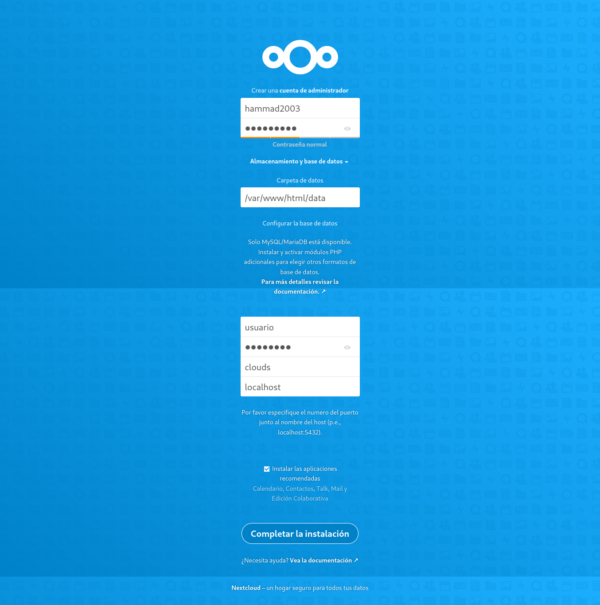

Al inicias sesión por primera vez se nos empezara a instalar "apps", esperaremos un poquito para que se acaben de instalar y nos llevara a la pagina de inicio.

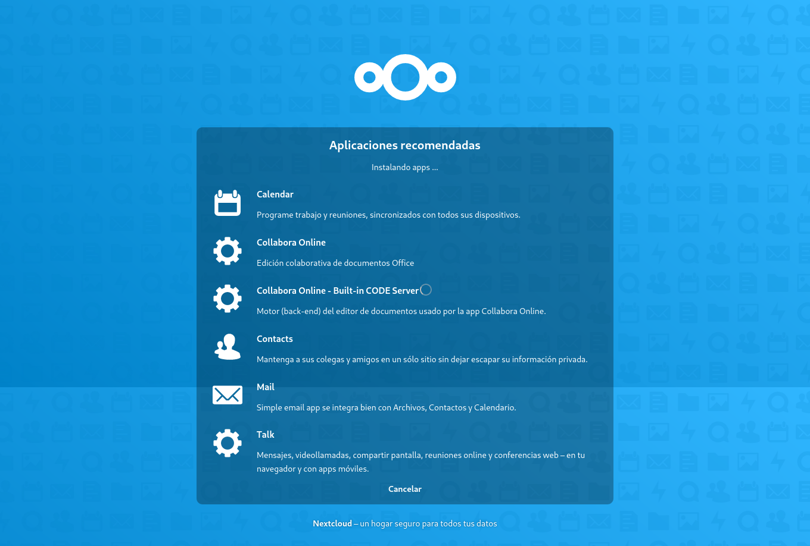

Cuando ya estemos en la pagina del inicio le daremos clic al nombre de nuestro perfil a la opción `usuarios`.

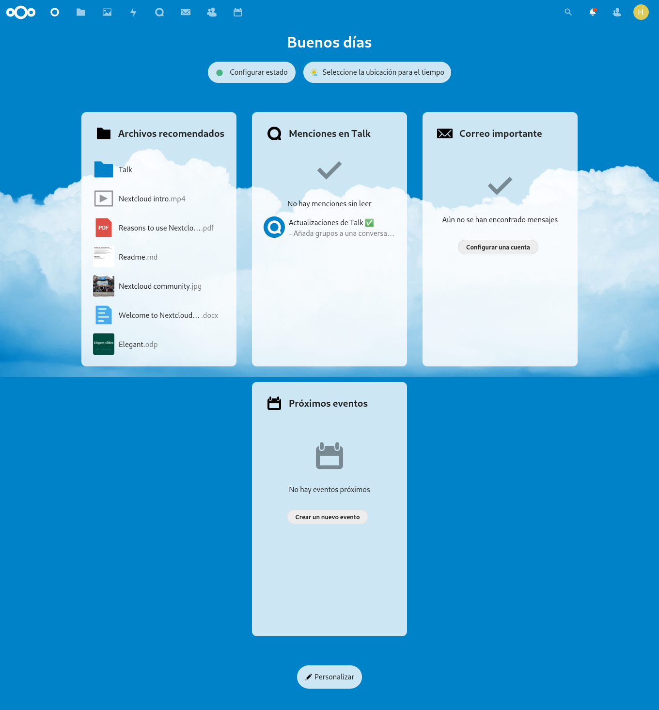

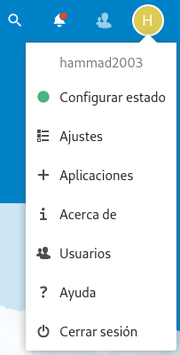

Una vez estemos ya en la pagina de usuarios, lo primero que haremos sera crear un grupo dando le clic a `añadir grupo` y lo nombraremos como queramos y le daremos a `enter` o al `icono de la flecha`.

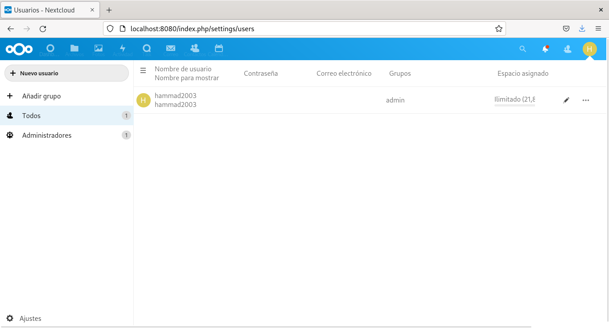

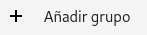

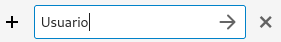

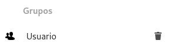

Ya creado el grupo procedemos a crear nuestro usuario, para ello le daremos clic donde pone `nuevo usuario`.

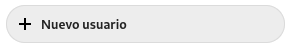

Al darle clic nos saldrá una pequeña venta la cual tendremos que rellenar con datos como el nombre, la contraseña, el correo, el grupo al cual queremos asignarlo y la capacidad de GB que queremos que tenga, en este caso nuestro usuario se llama `usuario` y lo hemos asignado al grupo `usuario` y le hemos puesto una capacidad máxima de `5 GB`, una vez rellenado los datos le daremos clic a `añadir nuevo usuario`.

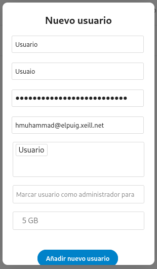

Ya creado el usuario con sus respectivas preferencias "características y roles" le daremos clic al icono de la carpeta.

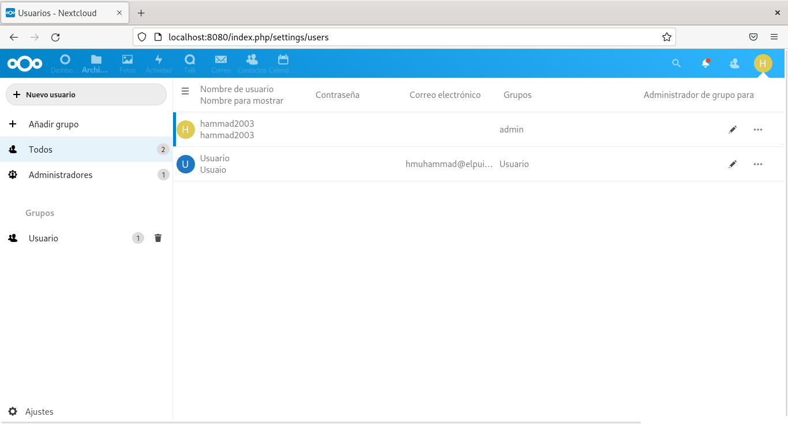

Al darle clic al icono nos llevara a la pagina de carpetas, ahora le daremos clic al `+` y se nos abrirá una pequeña pestaña y al lado del icono del archivo pondremos el nombre que queramos para nombrar nuestra carpeta.

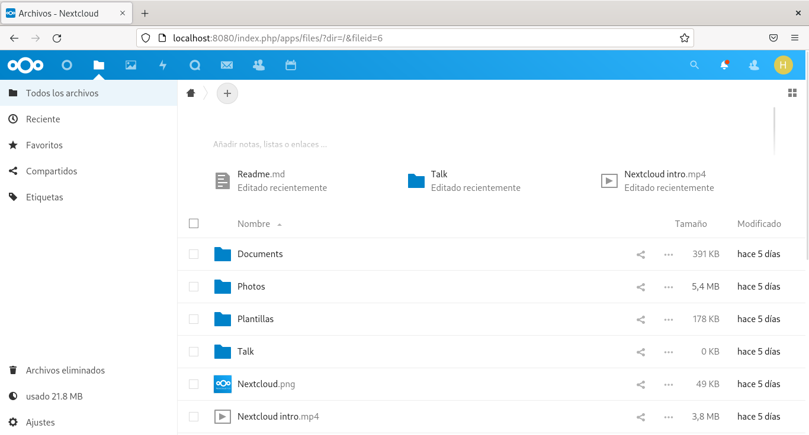

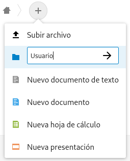

Una vez ya creada nuestra carpeta le daremos clic al icono de compartir y se nos abrirá un ventana a la derecha y le daremos a la opción `compartir`y allí escribimos el nombre de nuestro grupo o de nuestro usuario que anteriormente hemos creado, en este caso añadimos el grupo Usuario y le asignamos los permiso que queramos, en mi caso le he dado todos los permisos que básicamente serian los siguientes, `permitir edición`, `permitir la creación`, `permitir la eliminación`, `permitir recompartir`.

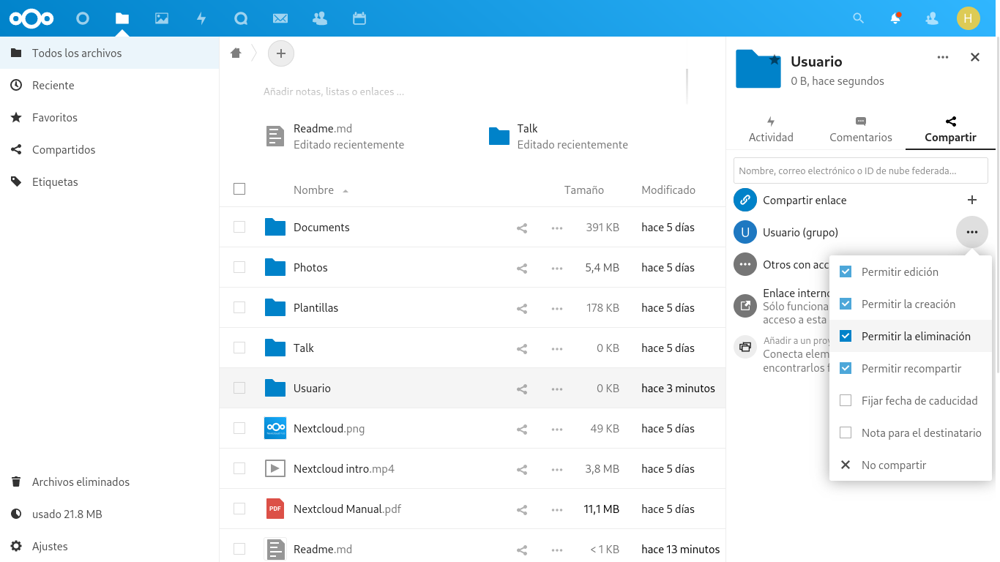

Esto seria una de las maneras de configurar nuestro `Nextcloud`.
