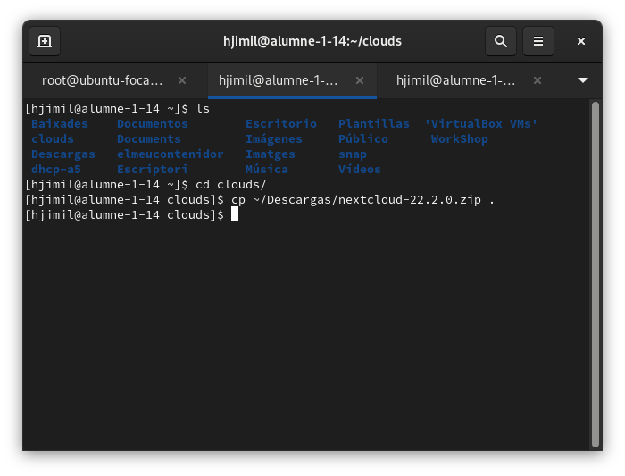

# NextCloud

# Instalación de Vagrantfile

Para instalar el Vagrantfile procedemos a crear una carpeta con el nombre que queramos y entramos en ella, esto lo hacemos con los siguientes comandos.

```
mkdir ubuntu-focal
cd ubuntu-focal/
```

## Craer el Vagrantfile
Para crear nuestro Vagrantfile procedemos a realizar el siguiente comando poniendo al lado el nombre y la versión del SO que queremos.

```
vagrant init ubuntu/focal64
```

## Ejecutar Maquina Virtual con Vagrantfile
Una vez ya encendido, vamos a ejecutar el siguiente comando para que siempre a la hora de ejecutarse se ejecute con el programa di virtualización que utilizamos en este caso VirtualBox, y las de mas vezes solo tendremos que poner `Vagrant up`.

```
vagrant up --provider=virtualbox (Solo la primera vez)
vagrant up
```

## Apagar Maquina Virtual con Vagrantfile
Para apagar la maquina virtual de Vagrantfile utilizaremos el siguiente comando.

```
vagrant halt
```

## SSH a la Maquina Virtual con Vagrantfile
Para conectarnos mediante ssh a la máquina virtual no nos hace falta todo el rollo de poner ssh usuaio@192.168.10.100, sino que es más fácil sola mente tendremos que poner el siguiente comando.

```
vagrant ssh
```

## Instalar apache2, mysql y algunas librerías en el contenedor

Cuando ya hayamos entrado dentro mediante ssh vamos a proceder a actualizar el listado de paquetes y a descargar y instalar el `apache2`, `mysql` y algunas `librerías` para que todo funcione correctamente.

```
 apt update
 apt upgrade
 apt install apache2
 apt install mysql-server
 apt install php libapache2-mod-php
 apt install php-fpm php-common php-mbstring php-xmlrpc php-soap php-gd php-xml php-intl php-mysql php-cli php-ldap php-zip php-curl
```

## Configuramos apache2

Activamos el módulo `proxy_fcgi`:

```
a2enmod proxy_fcgi
```

Activamos la configuración de `php-fpm`:

```
a2enconf php-fpm
```

Reiniciamos el servidor:

```
systemctl restart apache2
```

## Creamos una base de datos y un usuario en MySQL


Accedemos a `MySQL` con el usuario `root`

```
mysql -u root
```

Creamos la base de datos con el nombre que desee, en mi caso `mibasededades`

```
CREATE DATABASE mibasededades;
```

Creamos un usuario llamado `miusuario`, le ponemos el password `mipassword` y le damos privilegios sobre nuestra base de datos `mibasededades`

```
CREATE USER 'miusuario'@'localhost' IDENTIFIED WITH mysql_native_password BY 'password';
```

```
GRANT ALL DONDE mibasededades.* to 'miusuario'@'localhost';
```

```
exit
```

Comprobamos que todo ha funcionado bien

```
mysql -u mi usuario -p
```

## Descomprimir el archivo .zip
Para poder descomprimir nuestro archivo .zip realizaremos los siguientes pasos.

#### Paso 1

Descargamos el archivo .zip desde la página de NextCloud dándole clic al botón de `Get NextCloud` a la opción `Server Packages`.


#### Paso 2

Al descargarnos el archivo .zip nos saldrá esta ventana le daremos a `Guardar archivo` y le daremos a aceptar.


#### Paso 3

Abrimos una terminal y procedemos a realizar los siguientes comandos.




```
unzip nextcloud-22.2.0.zip
```

## Otra manera de descomprimir el archivo .zip
Si de la primera manera no nos ha salido bien podemos descomprimir el archivo .zip realizando los siguientes comandos.

```
apt update

apt install unzip

cd /var/www/html

wget https://download.nextcloud.com/server/releases/nextcloud-22.2.2.zip

unzip nextcloud-22.2.2.zip
```

## Aplicación de permisos en nuestra aplicación web
Una vez ya descomprimidos el archivo .zip en el directorio `/var/www/html`, aplicamos los siguientes permisos.

```
cd /var/www/html
chmod -R 775 .
chown -R root:www-data .
```

## Accedemos a la Instalación de la aplicación mediante el navegador web
Para acceder a nuestro NextCloud pones lo siguiente en nuestro navegador.

```
http://localhost:8080
```
